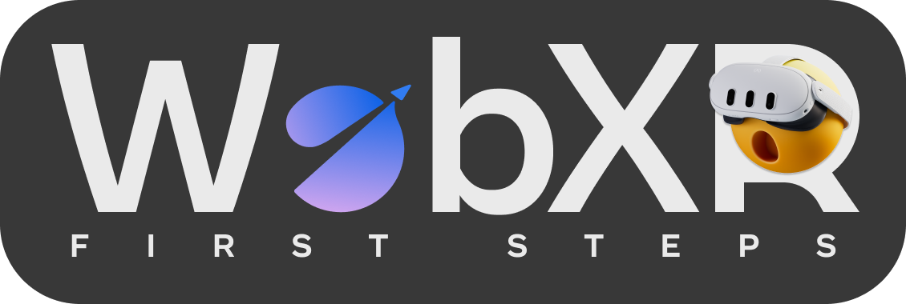

<p align="center">
    
</p>

Welcome to **WebXR First Steps**! This **2-hour** tutorial is designed to help you take your first steps into developing immersive WebXR experiences using [Three.js](https://threejs.org/). Whether you’re a web developer looking to expand your skillset or a hobbyist interested in creating virtual reality (VR) applications, this tutorial will guide you through the fundamentals of building interactive 3D worlds for the web.

## What You’ll Build

By the end of this tutorial, you’ll have created a fully functional WebXR game where players can use VR controllers to shoot targets, track their score, and enjoy an immersive experience complete with sound, vibration, and smooth animations. Here's what the final experience looks like:

<figure style="text-align: center;">
  
  <figcaption>Target Practice Gameplay</figcaption>
</figure>

## Setting Up Your Local Development Environment

To prepare your development environment and get started with building your WebXR experience, follow the steps below:

1. **Clone this repository**:

   ```bash
   git clone git@github.com:meta-quest/webxr-first-steps.git
   cd webxr-first-steps
   ```

2. **Verify that you have Node.js and npm installed**:

   - Node.js version: `20.x` or later
   - npm version: `10.x` or later
     You can check your versions with these commands:

   ```bash
   node -v
   npm -v
   ```

3. **Install dependencies**:

   ```bash
   npm install
   ```

4. **Run the local development server**:

   ```bash
   npm run dev
   ```

   After running the above command, your development server will be available at `localhost:8081`.

### Developing with a Headset

You can access the local development server from your XR headset by using one of two methods: via the IP address of your computer or by using ADB with port forwarding.

#### Accessing the Local Server on Your Headset via IP Address

On most home networks, you can access the local server by entering your computer's IP address and the port number (8081) in the browser on your VR headset. This information is displayed in the Webpack console when you start the server.

For example:

```bash
<i> [webpack-dev-server] Project is running at:
<i> [webpack-dev-server] On Your Network (IPv4): https://192.168.0.123:8081/
```

You might encounter a warning about an invalid certificate when accessing the site from your browser client, which you can safely dismiss to access your site.

#### Accessing the Local Server on Your Headset via ADB

If accessing via IP address doesn’t work due to network restrictions or firewall settings, you can use **ADB (Android Debug Bridge)** and port forwarding:

1. **Connect your headset to your computer**: Use a USB cable and enable developer mode on your headset. Check your device's official documentation for instructions on enabling developer mode.
2. **Set up port forwarding**: Open Chrome on your computer and navigate to `chrome://inspect/#devices`. Your headset should appear under **Remote Target**.

3. **Configure port forwarding**:
   - Click **Port forwarding...** in Chrome DevTools.
   - Add a rule to forward port `8081` from your computer to your headset.

You can now access the local server on your headset by entering `https://localhost:8081` in the browser. As with the IP address method, you may encounter a certificate warning, which can be dismissed.

### Developing with an Emulator

This project includes a built-in emulation setup located in `./src/init.js`, powered by [IWER](https://github.com/meta-quest/immersive-web-emulation-runtime/) (Immersive Web Emulation Runtime) and [@iwer/devui](https://github.com/meta-quest/immersive-web-emulation-runtime/tree/main/devui). The emulation setup automatically detects native WebXR support in your browser and activates itself if no native WebXR support is found.

If you're already using the [Immersive Web Emulator browser extension](https://chromewebstore.google.com/detail/immersive-web-emulator/cgffilbpcibhmcfbgggfhfolhkfbhmik), the built-in emulation will not conflict with it, and you can safely skip this section. However, if you use other WebXR emulators, we recommend disabling them and using the built-in emulation setup for the best results.

- **IWER** is a full WebXR runtime, and **@iwer/devui** provides a developer interface that exposes control over the emulated XR device created by IWER. With this setup, you can manipulate headset and controller transforms, and simulate input events for the emulated controllers.
- Additionally, you can leverage the **"Play Mode"** button on the top bar of the interface. This feature locks your cursor and allows you to control the emulated XR device like a first-person 3D experience on a PC.

Here’s a showcase of the emulation setup in action:

<figure style="text-align: center;">
  
  <figcaption>IWER & IWER/DevUI Showcase</figcaption>
</figure>

## Getting Started

This tutorial is structured into chapters to help you progressively build your WebXR game. Follow each chapter in sequence, as each builds upon concepts introduced in the previous ones.

- [**Chapter 1: Creating Simple Objects**](./tutorial/chapter1.md): Learn how to add basic 3D shapes like cubes, spheres, and cones to your scene.
- [**Chapter 2: Interacting with Controllers**](./tutorial/chapter2.md): Implement VR controller interactions and trigger actions based on user input.
- [**Chapter 3: Animating Objects**](./tutorial/chapter3.md): Make bullets move in the direction of the controller, and learn about time-based animation in WebXR.
- [**Chapter 4: Loading GLTF Models**](./tutorial/chapter4.md): Replace simple geometries with more complex, detailed 3D models using the GLTF format.
- [**Chapter 5: Hit Detection and Score Tracking**](./tutorial/chapter5.md): Implement proximity-based hit detection, track player progress, and display scores.
- [**Chapter 6: Finishing Touches**](./tutorial/chapter6.md): Add audio feedback, haptic feedback, and visual effects to make your game more immersive and polished.

We hope you enjoy working through the tutorial. Happy coding, and have fun building your WebXR game!

## Build and Deploy

Once you've completed the development of your WebXR game, you can build and deploy it for others to experience. Here's how you can do that:

### Deploying the App with GitHub Pages

This repository includes a ready-to-use GitHub Actions workflow located at `.github/workflows/deploy.yml`, which automates both the build and deployment to GitHub Pages. Once enabled, every time you push changes to the `main` branch, a new build will automatically be deployed.

#### Steps to Enable GitHub Pages Deployment:

1. **Fork this repository** to your own GitHub account.
2. Navigate to your forked repository’s **Settings**.
3. Scroll down to the **Pages** section.
4. Under **Build and Deployment**, change the **Source** to **GitHub Actions**.

Once this is set, GitHub Actions will handle the build and deployment process automatically. Any time you push changes to the `main` branch, the app will be built and deployed to GitHub Pages without any additional manual steps.

You can monitor the status of the deployment job or manually re-run it via the **Actions** tab in your GitHub repository.

### Deploying to Your Own Hosting Solution

If you prefer to host the app yourself, you’ll need to manually build the app and then deploy the generated files to your hosting provider.

To generate the build, run the following command:

```bash
npm run build
```

This will create a `dist` folder containing the static files for the app. You can then upload these files to your hosting platform of choice.

## Contributing

Please read [CONTRIBUTING.md](./CONTRIBUTING.md) for details on how to contribute to the project.

## License

This project is licensed under the MIT License - see the [LICENSE.md](./LICENSE) file for details.
