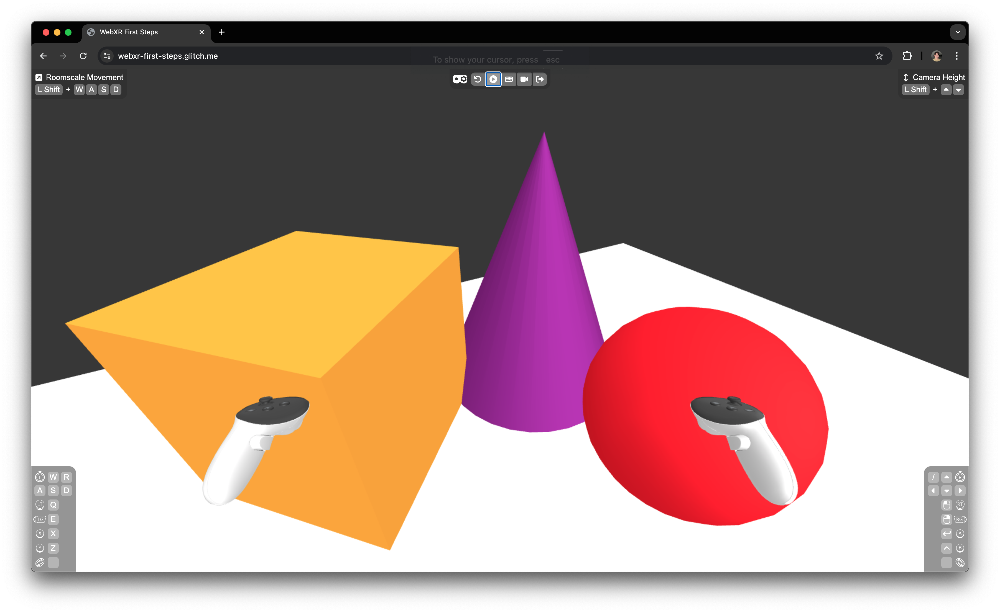

# Chapter 1: Creating Simple Objects in the Scene

Welcome to Chapter 1 of our WebXR tutorial! In this chapter, you’ll learn how to create and position simple objects in a 3D scene using Three.js, setting the foundation for more complex interactions.

## `setupScene` Function

The `setupScene` function is where you'll define the objects in your 3D environment. It’s the space where you arrange all the elements that will appear in your scene, leaving frame-by-frame updates for later.

### Meshes, Geometries, and Materials in Three.js

In Three.js, a **mesh** is the combination of **geometry** (the shape) and **material** (the appearance). Let’s use the floor as an example:

- **Geometry**: Defines the shape. For the floor, we use `PlaneGeometry` to create a 6x6 unit rectangle:

  ```javascript
  const floorGeometry = new THREE.PlaneGeometry(6, 6);
  ```

- **Material**: Defines how the surface looks. We use `MeshStandardMaterial` with a white color:

  ```javascript
  const floorMaterial = new THREE.MeshStandardMaterial({ color: 'white' });
  ```

- **Mesh**: Combines the geometry and material:
  ```javascript
  const floor = new THREE.Mesh(floorGeometry, floorMaterial);
  ```

Finally, we rotate and add the floor to the scene:

```javascript
floor.rotateX(-Math.PI / 2);
scene.add(floor);
```

## Task

Now, let’s add a cone, a cube, and a sphere to your `sceneSetup`, each with its own geometry, material, and transformations.

### 1. **Adding a Cone**

```javascript
const coneGeometry = new THREE.ConeGeometry(0.6, 1.5);
const coneMaterial = new THREE.MeshStandardMaterial({ color: 'purple' });
const cone = new THREE.Mesh(coneGeometry, coneMaterial);
scene.add(cone);
cone.position.set(0.4, 0.75, -1.5);
```

- **Geometry**: `ConeGeometry(0.6, 1.5)` creates a cone with a base radius of 0.6 units and a height of 1.5 units.
- **Material**: `MeshStandardMaterial` gives the cone a purple color and realistic lighting.
- **Positioning**: The cone is positioned at `(0.4, 0.75, -1.5)`.

### 2. **Adding a Cube**

```javascript
const cubeGeometry = new THREE.BoxGeometry(1, 1, 1);
const cubeMaterial = new THREE.MeshStandardMaterial({ color: 'orange' });
const cube = new THREE.Mesh(cubeGeometry, cubeMaterial);
scene.add(cube);
cube.position.set(-0.8, 0.5, -1.5);
cube.rotateY(Math.PI / 4);
```

- **Geometry**: `BoxGeometry(1, 1, 1)` creates a 1x1x1 cube.
- **Rotation**: The cube is rotated 45 degrees around the Y-axis using `rotateY(Math.PI / 4)`.

### 3. **Adding a Sphere**

```javascript
const sphereGeometry = new THREE.SphereGeometry(0.4);
const sphereMaterial = new THREE.MeshStandardMaterial({ color: 'red' });
const sphere = new THREE.Mesh(sphereGeometry, sphereMaterial);
scene.add(sphere);
sphere.position.set(0.6, 0.4, -0.5);
sphere.scale.set(1.2, 1.2, 1.2);
```

- **Geometry**: `SphereGeometry(0.4)` creates a sphere with a 0.4-unit radius.
- **Scaling**: The sphere is scaled up by 20% using `scale.set(1.2, 1.2, 1.2)`.

## Summary

In this chapter, you've learned how to combine geometry and material to form meshes and how to apply transformations such as positioning, rotation, and scaling to manipulate objects in 3D space. This foundational knowledge will be crucial as we move on to more advanced topics in the following chapters.

Here’s what our scene looks like now:


