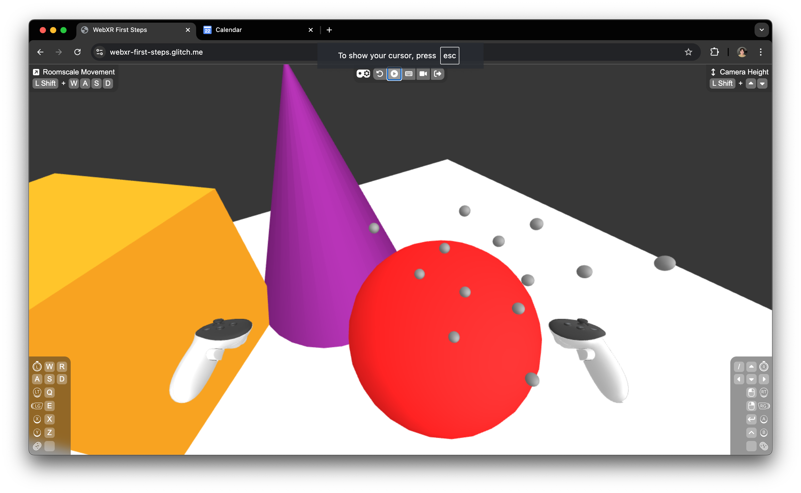

# Chapter 2: Working with Controllers

In Chapter 2, we’ll explore how to interact with a WebXR scene using VR controllers. By the end of this chapter, you'll be able to respond to controller inputs and trigger actions within your scene. Specifically, we’ll focus on detecting button presses and using them to spawn a “bullet” from the controller into the scene. In the next chapter, we’ll focus on moving these bullets, but for now, let’s focus on spawning them.

## `onFrame` Function

The `onFrame` function is where we handle updates for every frame. It receives two key arguments in addition to the global variables in `setupScene`:

- **`delta`**: The time since the last frame in seconds. This is useful for making time-based animations or movements.
- **`time`**: The total elapsed time since the app started. This can be used for tracking overall progress or creating time-based effects.

You’ll use `onFrame` to check for controller input and trigger actions based on those inputs.

## Introducing the Bullet

To start, we’ll introduce a bullet—a small gray sphere that will be fired from the controller when the trigger button is pressed. We will set it up as a global variable so that we can access it later in our frame loop and event handlers:

```javascript
const bulletGeometry = new THREE.SphereGeometry(0.02);
const bulletMaterial = new THREE.MeshStandardMaterial({ color: 'gray' });
const bulletPrototype = new THREE.Mesh(bulletGeometry, bulletMaterial);
```

### Explanation:

- **Bullet Geometry and Material**: The bullet is a small sphere with a radius of `0.02`, using a gray `MeshStandardMaterial`. This gives the bullet its shape and appearance.

- **Cloning the Bullet**: The `bulletPrototype` is a mesh that we’ll clone each time we want to spawn a new bullet. Cloning is an efficient way to create multiple instances of an object. The cloned objects share the same geometry and material, which saves memory and ensures consistent appearance across all bullets.

## Handling Controller Input

Now, let’s handle the controller input within the `onFrame` function to spawn bullets when the trigger is pressed:

```javascript
import { XR_BUTTONS } from 'gamepad-wrapper';

function onFrame(
	delta,
	time,
	{ scene, camera, renderer, player, controllers },
) {
	if (controllers.right) {
		const { gamepad, raySpace } = controllers.right;
		if (gamepad.getButtonClick(XR_BUTTONS.TRIGGER)) {
			const bullet = bulletPrototype.clone();
			scene.add(bullet);
			raySpace.getWorldPosition(bullet.position);
			raySpace.getWorldQuaternion(bullet.quaternion);
		}
	}
}
```

### Explanation:

- **Controller Detection**: The `if (controllers.right)` check ensures that a right-hand controller is connected and active.

- **Button Press Handling**: We use `gamepad.getButtonClick(XR_BUTTONS.TRIGGER)` to detect when the trigger button is pressed during the current frame on the right controller. This functionality is provided by the `gamepad-wrapper` library, which tracks the state of gamepad buttons frame by frame. This ensures that you can reliably detect events such as single button presses. For more information, you can refer to the gamepad-wrapper [documentation](https://github.com/felixtrz/gamepad-wrapper)

- **Spawning the Bullet**: When the trigger is pressed, we clone the `bulletPrototype` to create a new bullet and add it to the scene with `scene.add(bullet)`.

- **Bullet Positioning**: The `raySpace.getWorldPosition(bullet.position)` method sets the bullet’s position to the world position of the controller's ray space. This is necessary because the controller ray space and the bullet do not share the same parent in the scene graph. The bullet’s parent is the `scene`, meaning its position is interpreted as its world position. Therefore, to correctly position the bullet at the controller’s tip, we retrieve the ray space’s world position and apply it directly to the bullet.

### Explanation:

- **Controller Detection**: The `if (controllers.right)` check ensures that a right-hand controller is connected and active.

- **Button Press Handling**: We use `gamepad.getButtonClick(XR_BUTTONS.TRIGGER)` to detect when the trigger button is pressed during the current frame on the right controller. This functionality is provided by the `gamepad-wrapper` library, which tracks the state of gamepad buttons frame by frame. This ensures that you can reliably detect events such as single button presses. For more information, you can refer to the gamepad-wrapper [documentation](https://github.com/felixtrz/gamepad-wrapper).

- **Spawning the Bullet**: When the trigger is pressed, we clone the `bulletPrototype` to create a new bullet and add it to the scene with `scene.add(bullet)`.

- **Controller Ray Space**: The `raySpace` represents the XR controller's ray-casting direction and position in 3D space. It is a special object managed by Three.js that represents where the user is pointing. In VR, ray spaces are often used to interact with objects in the world by projecting a laser-like ray from the controller. In this case, we use the `raySpace` to determine the origin and direction for spawning bullets, ensuring that they are fired from the controller's tip and in the right direction.

- **Bullet Positioning**: The `raySpace.getWorldPosition(bullet.position)` method sets the bullet’s position to the world position of the controller's ray space. This is necessary because the controller ray space and the bullet do not share the same parent in the scene graph. The bullet’s parent is the `scene`, meaning its position is interpreted as its world position. Therefore, to correctly position the bullet at the controller’s tip, we retrieve the ray space’s world position and apply it directly to the bullet.

- **Bullet Orientation**: In addition to positioning, we need to correctly orient the bullet. The method `raySpace.getWorldQuaternion(bullet.quaternion)` retrieves the world quaternion (i.e., orientation) of the controller's ray space and applies it to the bullet. This ensures the bullet is aligned with the controller’s orientation when fired. Without this step, the bullet might spawn in the correct location but at the wrong angle, leading to unintended behavior later when we animate it.

## Summary

In this chapter, you’ve learned how to interact with your WebXR scene using a VR controller. We introduced the concept of detecting controller input and used it to spawn bullets into the scene when the trigger button is pressed. This sets the stage for more complex interactions, like moving these bullets, which we’ll cover in the next chapter.

Here’s what our scene looks like after adding the bullet spawning feature:


