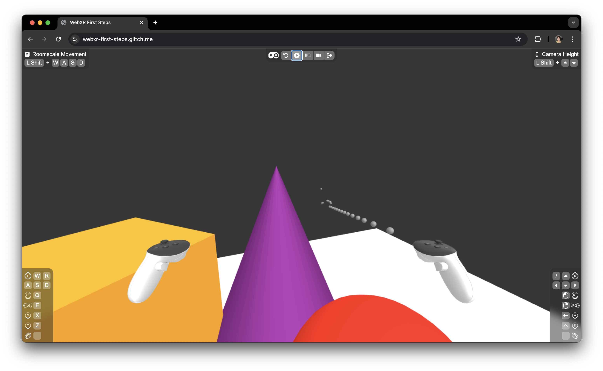

# Chapter 3: Animating Bullet Objects

In this chapter, we’ll focus on animating the bullets that we spawned in the previous chapter. Specifically, we’ll make the bullets move forward in the direction the controller is pointing and disappear after a short duration. This involves managing the bullets’ movement, ensuring they don’t remain in the scene indefinitely, and updating their positions each frame.

## Constants for Bullet Behavior

We begin by defining constants that will control the behavior of the bullets:

```javascript
const forwardVector = new THREE.Vector3(0, 0, -1);
const bulletSpeed = 5;
const bulletTimeToLive = 1;
```

- **`forwardVector`**: This vector points forward along the negative Z-axis. It represents the default direction in which bullets will move.
- **`bulletSpeed`**: Sets the speed of the bullets, meaning they will travel 5 units per second.
- **`bulletTimeToLive`**: Determines how long each bullet will remain active in the scene (1 second). This ensures bullets that are no longer visible are removed to prevent performance degradation over time.

## Managing Active Bullets

We use an object to keep track of all active bullets:

```javascript
const bullets = {};
```

- **`bullets`**: This object stores all active bullets using their unique IDs (`uuid`). This allows us to manage and update each bullet individually during every frame.

## Setting Up Bullet Velocity and Lifespan

In our `onFrame` function, when a bullet is fired, we calculate its movement direction and assign it a time-to-live (TTL):

```javascript
if (controllers.right) {
	const { gamepad, raySpace } = controllers.right;
	if (gamepad.getButtonClick(XR_BUTTONS.TRIGGER)) {
		const bullet = bulletPrototype.clone();
		scene.add(bullet);
		raySpace.getWorldPosition(bullet.position);
		raySpace.getWorldQuaternion(bullet.quaternion);

		const directionVector = forwardVector
			.clone()
			.applyQuaternion(bullet.quaternion);
		bullet.userData = {
			velocity: directionVector.multiplyScalar(bulletSpeed),
			timeToLive: bulletTimeToLive,
		};
		bullets[bullet.uuid] = bullet;
	}
}
```

### Explanation:

- **`globalQuaternion`**: This represents the controller’s orientation in world space. By getting the world quaternion of the controller’s ray space, we capture how the controller is rotated in 3D space.

- **`directionVector`**: To determine the direction in which the bullet will move, we take the `forwardVector` and apply the `globalQuaternion` to it. This rotates the forward vector to match the orientation of the controller. This step is crucial because it ensures that bullets are fired in the direction the controller is pointing, regardless of its rotation.

- **`userData`**: Three.js provides a built-in `userData` property on all `Object3D` instances, which we can use to store custom information about our objects. Here, we store the bullet’s velocity (its movement direction and speed) and its TTL. This data will be used to update the bullet’s position and ensure it’s removed after its lifespan ends.

## Updating Bullet Positions and Lifespan

Each frame, we update the bullets' positions and reduce their TTL:

```javascript
Object.values(bullets).forEach((bullet) => {
	if (bullet.userData.timeToLive < 0) {
		delete bullets[bullet.uuid];
		scene.remove(bullet);
		return;
	}
	const deltaVec = bullet.userData.velocity.clone().multiplyScalar(delta);
	bullet.position.add(deltaVec);
	bullet.userData.timeToLive -= delta;
});
```

### Explanation:

- **Lifespan Check**: Each bullet’s TTL decreases over time. Once the TTL drops below zero, the bullet is removed from both the scene and the `bullets` object to free up resources and maintain performance.

- **Position Update**: The bullet’s position is updated by moving it along its velocity vector, scaled by `delta` (the time since the last frame). This makes the bullet move forward at the correct speed each frame.

## Summary

In this chapter, you’ve enhanced your WebXR scene by animating the bullets. Now, when fired, the bullets travel in the direction the controller is pointing and disappear after a set time. This addition introduces dynamic motion into your scene and helps maintain performance by cleaning up bullets after they’re no longer needed.

Here’s what our scene looks like with the bullet animation feature:


