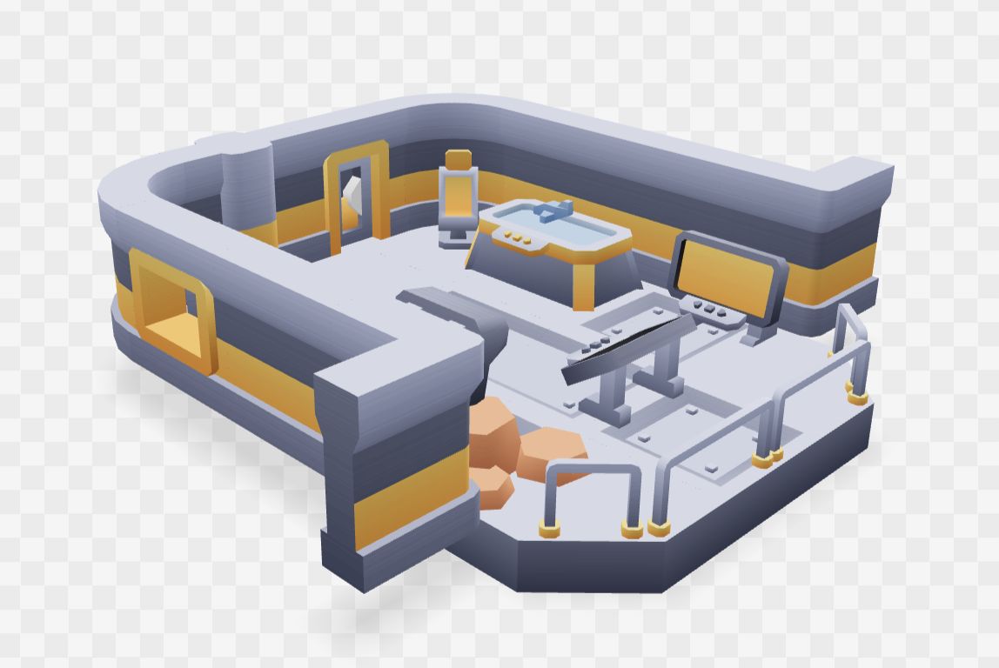
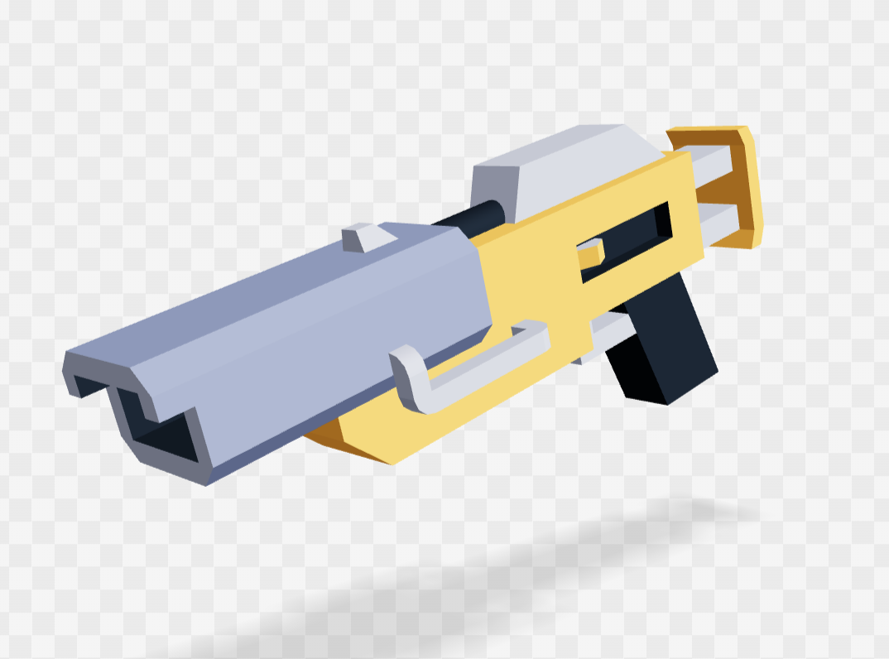
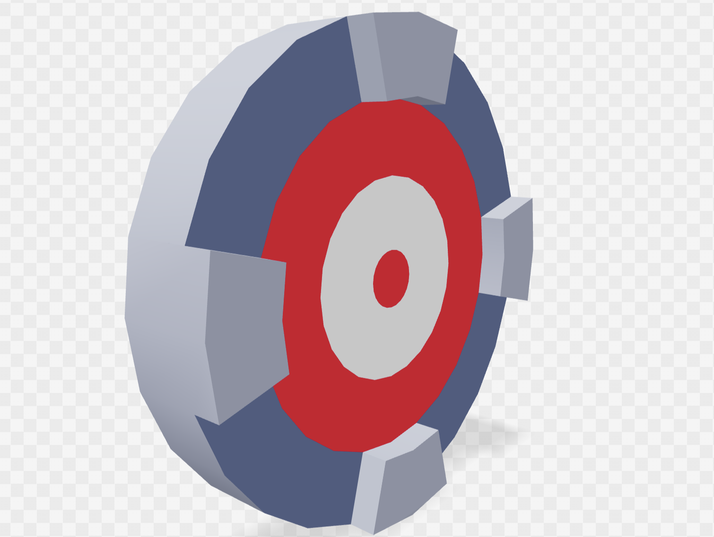
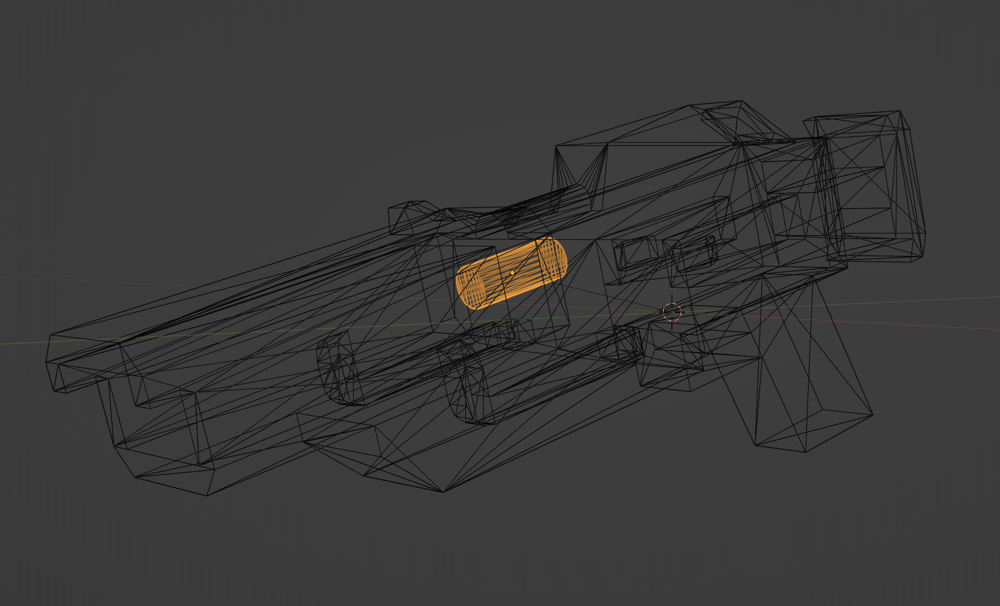
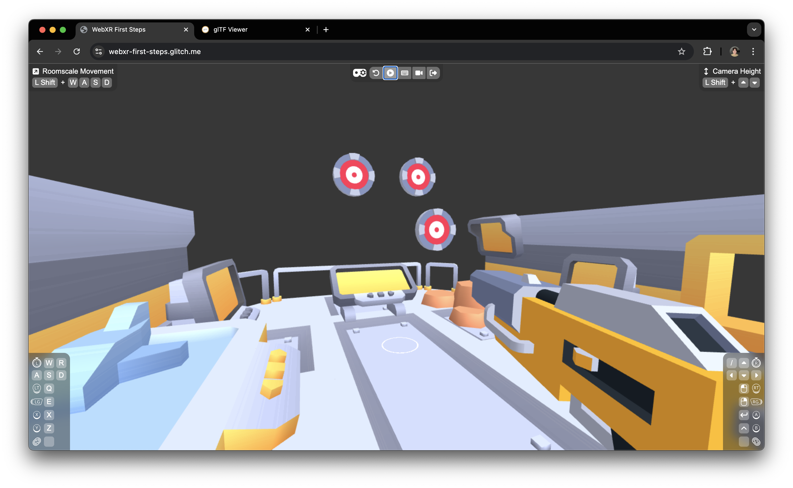

# Chapter 4: Replacing Basic Objects with GLTF Models

In this chapter, we’ll take your WebXR experience to the next level by replacing the basic geometries we've used so far with detailed 3D models loaded from GLTF files. GLTF is a popular format for transmitting 3D models on the web because it's compact, efficient, and easy to use in Three.js.

## Loading GLTF Models

We’ll use the `GLTFLoader` from Three.js to load our 3D models. The models we’ll be using are a space station, a blaster, and a set of targets. Here’s how we load and set them up in the scene:

### Setting Up the Scene

```javascript
import { GLTFLoader } from 'three/addons/loaders/GLTFLoader.js';

// global variables
const blasterGroup = new THREE.Group();
const targets = []; // array to keep track of targets, we will need to use this later

function setupScene({ scene, camera, renderer, player, controllers }) {
	const gltfLoader = new GLTFLoader();

	// Load the space station environment
	gltfLoader.load('assets/spacestation.glb', (gltf) => {
		scene.add(gltf.scene);
	});

	// Load the blaster model
	gltfLoader.load('assets/blaster.glb', (gltf) => {
		blasterGroup.add(gltf.scene);
	});

	// Load and clone the target models
	gltfLoader.load('assets/target.glb', (gltf) => {
		for (let i = 0; i < 3; i++) {
			const target = gltf.scene.clone();
			// spawn targets at random locations in front of the player
			target.position.set(
				Math.random() * 10 - 5,
				i * 2 + 1,
				-Math.random() * 5 - 5,
			);
			scene.add(target);
			targets.push(target);
		}
	});
}
```

### Explanation:

- **GLTFLoader**: We use `GLTFLoader` to load 3D models from GLTF files. Each model is loaded asynchronously, and once loaded, it’s added to the scene or another relevant group (like the blaster group).

- **Space Station**: The space station model is added directly to the scene, providing an immersive environment for your WebXR experience. Here’s how it looks:

  

- **Blaster**: We created the `blasterGroup` as an empty `THREE.Group` to house the blaster model. This way we can manipulate its transform right away without waiting for the blaster model to finish loading. The blaster model is added to the `blasterGroup`, which will be attached to the right controller when the user interacts with it. Here’s a glimpse of the blaster:

  

- **Targets**: Three instances of the target model are created by cloning the original model. Each target is randomly positioned within the scene, providing dynamic and varied locations for the user to aim at. Here's what it looks like:

  

## Attaching the Blaster to the Controller

The blaster model is attached to the right controller when it first comes alive (after entering VR). We do this in the `onFrame` function rather than `setupScene` because we need to wait for the controller to be active:

```javascript
function onFrame(
	delta,
	time,
	{ scene, camera, renderer, player, controllers },
) {
	if (controllers.right) {
		const { gamepad, raySpace, mesh } = controllers.right;

		// Attach the blaster to the right controller
		if (!raySpace.children.includes(blasterGroup)) {
			raySpace.add(blasterGroup);
			mesh.visible = false; // Hide the default controller model
		}

		// Firing bullets
		if (gamepad.getButtonClick(XR_BUTTONS.TRIGGER)) {
			// use the embedded bullet as prototype
			const bulletPrototype = blasterGroup.getObjectByName('bullet');
			if (bulletPrototype) {
				const bullet = bulletPrototype.clone();
				scene.add(bullet);
				// copy position and quaternion directly from the bulletPrototype, instead of from raySpace
				bulletPrototype.getWorldPosition(bullet.position);
				bulletPrototype.getWorldQuaternion(bullet.quaternion);
				// ...  unchanged logic
			}
		}
	}
	// ...  unchanged logic
}
```

### Explanation:

- **Attaching the Blaster**: The blaster model is attached to the right controller’s ray space. This is done in `onFrame` because the controller becomes active only after entering VR. Once attached, the default controller model is hidden by setting `mesh.visible = false`.

- **Embedded Bullet Prototype**: The bullet prototype is now embedded within the blaster model. This prototype serves two purposes: it acts as the base for cloning new bullets, and it serves as a marker from which we can read the starting position and orientation of each bullet. Here’s how it looks inside the blaster:

  

- **Bullet Firing**: When the trigger is pressed, a new bullet is cloned from the prototype, and its position and orientation are set to match the blaster. The bullet is then added to the scene and animated as described in previous chapters.

## Summary

In this chapter, you’ve replaced basic geometric shapes with detailed GLTF models, enhancing the realism and immersion of your WebXR experience. You’ve also attached the blaster model to the controller, allowing for a more integrated and interactive shooting experience. Additionally, the bullet prototype embedded in the blaster serves as both a cloning source and a position/orientation marker. In the next chapters, we’ll continue to build on this foundation by adding more complex interactions and gameplay elements.

Here’s what our scene looks like with the GLTF models:


